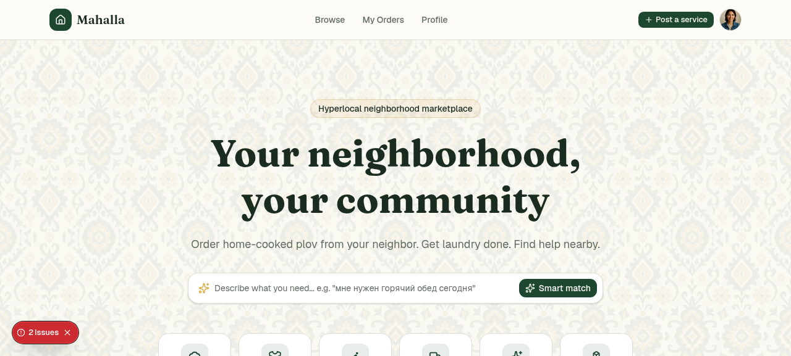
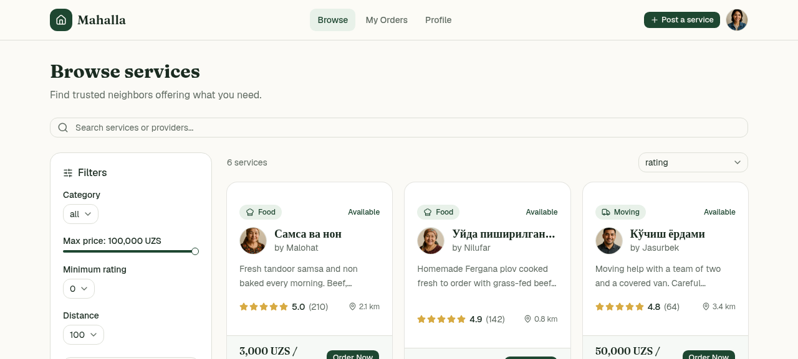
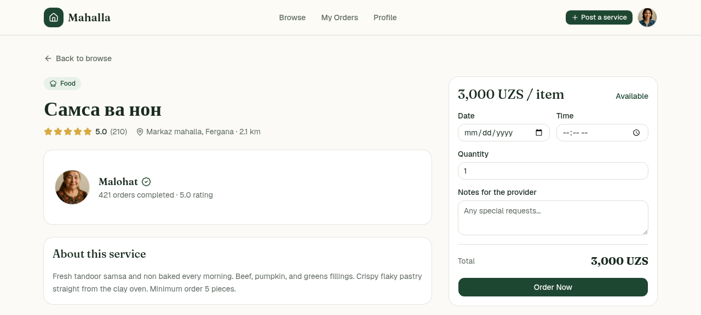
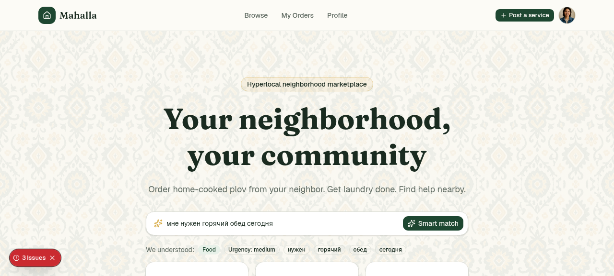
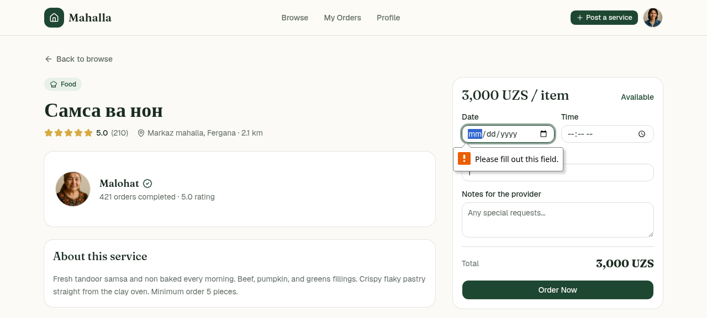
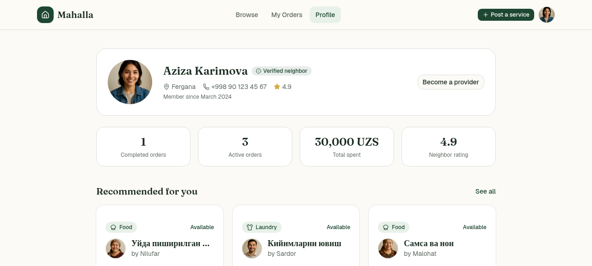
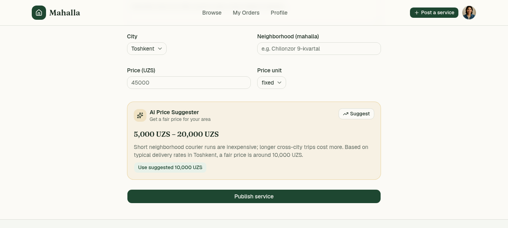
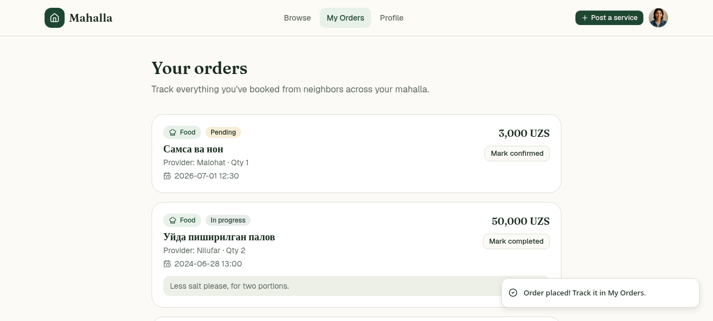

# Mahalla

Hyperlocal neighborhood marketplace connecting residents with local service providers and sellers in Fergana, Uzbekistan.

## Problem Statement
In Fergana, Uzbekistan, finding trustworthy local service providers (like home cooks, tutors, or cleaners) is highly fragmented. Residents rely on unstructured Telegram groups or word-of-mouth recommendations, leading to unsafe transactions, lack of price transparency, and zero accountability. There is no unified, trusted hyperlocal platform dedicated to connecting neighbors with local micro-businesses in the region.

## Solution Overview
Mahalla — маркетплейс, где соседи публикуют объявления (услуги/товары), находят провайдеров рядом, общаются и заказывают напрямую внутри своего района (mahalla).

## Disclosure
Core architecture (marketplace, listings, orders, AI-powered moderation via Gemma 4 31B) was originally developed for the H0 Hackathon. For Technoviz Summer of Code, we added multi-user identity — replacing a single hardcoded demo account with per-visitor cookie-based sessions, so each user now has their own profile, orders, and provider status.

## Features
- **Browse Local Services & Products**: Find services by categories (Food, Laundry, Delivery, Moving, Cleaning, and others) with local distance estimation.
- **AI-Powered Listing Moderation & Price Suggestions**: Listings are checked for safety via Google Generative Language API (using Gemma 4 31B), and sellers get dynamic, area-aware price guidelines.
- **Dynamic Per-Visitor Profiles**: Automatic unique session generation via persistent cookies, maintaining custom profiles, ratings, and order history.
- **Interactive Order Management**: Track pending, confirmed, active, and completed orders with state progression.
- **Sleek Multi-Language Interface**: Full localization support in English, Russian, and Uzbek.

## Technology Stack
- **Framework**: Next.js 16 (App Router)
- **Runtime & UI**: React 19 & Tailwind CSS v4
- **Database**: AWS DynamoDB (Single-table design)
- **AI Integration**: Gemma 4 (31B) via Google AI Studio API
- **UI Components**: Base UI (`@base-ui/react`), Sonner, and Lucide React
- **Data Fetching**: SWR (Stale-While-Revalidate)

## Installation
```bash
git clone https://github.com/Jasurcyb/Mahallla.git
cd Mahallla
pnpm install
pnpm dev
```
Requires `.env` with AWS credentials (DynamoDB) and Gemma API key.

## Usage
1. Visit the app — you get a unique session automatically.
2. Browse listings or post your own.
3. Edit your profile to set your name, phone number, and city.
4. Set your provider profile to offer services.

## Live Demo
https://mahalla-marketplace-app.vercel.app

## Screenshots









## Team
- **Jasurcyb** — full-stack development
- **Azizbek Nazirjonov** — design, video

## Future Scope
- Full OTP-based authentication
- In-app messaging between residents
- Expansion beyond Fergana

## License
MIT
